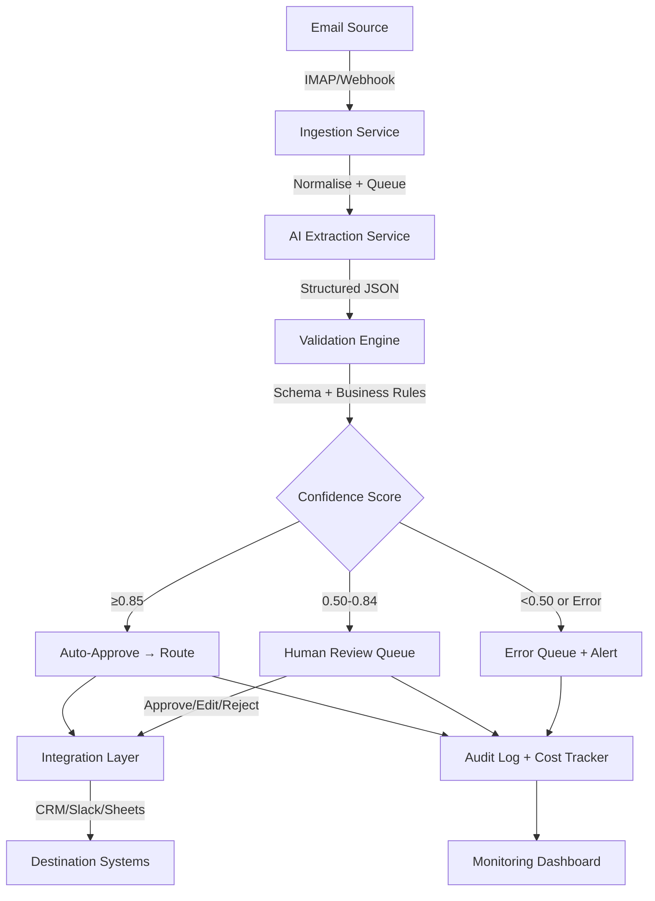

# AI AUTOMATION PROJECT TEMPLATE
## Build Process & Cursor Engineering Playbook
## How to Take a Project from Zero to 10/10

---

**Purpose:** This document defines the PROCESS for building portfolio projects. It tells you (and Cursor) HOW to build, in what order, with what discipline.

**This document does NOT repeat the engineering standards.** It references them:
- **AI-ENGINEERING-PLAYBOOK.md** → How Cursor should write code (rules, anti-patterns, `.cursorrules`)
- **PORTFOLIO-ENGINEERING-STANDARD.md** → Code patterns, architecture templates, exact implementations
- **PORTFOLIO-10-OUT-OF-10-ADDENDUM.md** → Everything required for 10/10 score, per-project checklists
- **PORTFOLIO-AUDIT-AND-ROADMAP.md** → Project-specific upgrades, case studies, scoring

**Feed all five documents into Cursor.** This one drives the build workflow. The Playbook constrains code quality. The other three define the quality bar.

---

# PHASE 0: DESIGN BEFORE CODE

**Rule: No code is written until Phase 0 is complete.**

This is the phase most developers skip and it's why most portfolio projects look like demos. A 10/10 project has visible evidence of upfront design — architecture documents, decision records, and a clear problem definition that existed BEFORE the first line of code.

## 0.1 Problem Definition

Create: `docs/problem-definition.md`

This document must answer:

```markdown
# Problem Definition: [Project Name]

## Business Context
Who has this problem? What type of company, what size, what industry?

## Current Manual Process
Step-by-step: what does a human do today?
How long does each step take?
How many times per day/week does this happen?

## Pain Points
What goes wrong? What's slow? What's error-prone?
What happens when the key person is sick/leaves?

## Automation Opportunity
Which steps can be automated? Which require human judgement?
What's the expected impact (time saved, error reduction, cost)?

## Inputs
What data enters the system? In what format?
What's the volume? What's the worst-case input?

## Outputs
What must the system produce?
What systems must it integrate with?
What format do downstream systems expect?

## Failure Modes
What happens when the AI is wrong?
What happens when an external API is down?
What's the human fallback for every automated step?

## Success Criteria
How do we measure whether this system works?
What accuracy/speed/cost thresholds define success?
```

**Why this matters to reviewers:** A problem definition file in the repo tells a CTO that you started by understanding the business problem, not by writing code. This is the single biggest signal of engineering maturity.

## 0.2 System Architecture

Create: `docs/architecture.md`

Must include:

1. **System diagram** (Mermaid or ASCII) showing:
   - All input sources
   - Every processing step
   - Decision points (where does the system branch?)
   - All output destinations
   - All external service dependencies
   - All data stores
   - Monitoring/observability touchpoints

2. **Data flow** — trace a single item from input to final output, noting every transformation

3. **Failure paths** — for every external dependency, document:
   - What happens when it's unavailable?
   - Retry strategy
   - Circuit breaker threshold
   - Human fallback
   - How is the failure logged?

4. **Security boundaries** — what data crosses which boundaries? What's sanitised where?

Example architecture diagram:



## 0.3 Architecture Decision Records

Create: `docs/decisions/`

Every project must have 3-5 ADRs documenting non-obvious decisions. These show technical judgement — the thing senior engineers value most.

**ADR Template:**

```markdown
# ADR [number]: [Decision Title]

## Status
Accepted | Superseded | Deprecated

## Context
What is the problem? What constraints exist?
What options were considered?

## Options Considered

### Option A: [Name]
- Pro: ...
- Con: ...

### Option B: [Name]
- Pro: ...
- Con: ...

### Option C: [Name]
- Pro: ...
- Con: ...

## Decision
Which option was chosen and WHY.

## Consequences
What changes as a result?
What new constraints does this introduce?
What trade-offs are we accepting?
```

**Every project should have ADRs for at minimum:**

| # | Decision | Why It Matters |
|---|----------|---------------|
| 001 | LLM provider selection | Shows you evaluated options, not just defaulted |
| 002 | Confidence scoring approach | Shows you thought about when AI is wrong |
| 003 | Data storage strategy | Shows database design thinking |
| 004 | Error handling and retry strategy | Shows resilience thinking |
| 005 | Prompt design approach | Shows AI engineering maturity |

## 0.4 Implementation Plan

Create: `docs/implementation-plan.md`

This defines the BUILD ORDER. Every phase produces a working commit. No phase is larger than 2-3 hours of work.

```markdown
# Implementation Plan: [Project Name]

## Phase 1: Project Scaffold (1-2 hours)
- [ ] Initialise repo with standard structure
- [ ] pyproject.toml, Makefile, .gitignore, .env.example
- [ ] Docker + docker-compose
- [ ] FastAPI app with health endpoint
- [ ] Database connection + initial migration
- [ ] CI pipeline (lint + test)
- **Commit:** "chore: initial project scaffold with Docker and CI"
- **Acceptance:** `make docker` starts the app, `/health` returns 200

## Phase 2: Core Domain Models (1-2 hours)
- [ ] Pydantic schemas for inputs/outputs
- [ ] SQLAlchemy models for persistence
- [ ] Alembic migration for initial schema
- [ ] Custom exception hierarchy
- [ ] Configuration with Pydantic Settings
- **Commit:** "feat: add domain models, schemas, and database migration"
- **Acceptance:** Migration runs, models match schema

## Phase 3: AI Client Abstraction (2-3 hours)
- [ ] AI client wrapper with retry, circuit breaker, cost tracking
- [ ] Prompt templates with versioning
- [ ] Structured output parsing with Pydantic validation
- [ ] Unit tests for extraction logic (mocked LLM)
- **Commit:** "feat: add AI client with cost tracking and prompt versioning"
- **Acceptance:** Tests pass with mocked responses

## Phase 4: Core Processing Pipeline (3-4 hours)
- [ ] Input ingestion and normalisation
- [ ] AI extraction integration
- [ ] Confidence scoring (composite: completeness + type compliance + AI confidence)
- [ ] Decision engine (auto-approve / review / error)
- [ ] Audit trail logging
- [ ] Integration tests for full pipeline
- **Commit:** "feat: implement core extraction pipeline with confidence scoring"
- **Acceptance:** Pipeline processes sample input end-to-end

## Phase 5: Human Review System (2-3 hours)
- [ ] Review queue (GET pending, POST approve/edit/reject)
- [ ] Review actions logged to audit trail
- [ ] Review UI endpoint or documented API
- **Commit:** "feat: add human review queue with audit logging"
- **Acceptance:** Items route to review, actions persist correctly

## Phase 6: Integration Layer (2-3 hours)
- [ ] Output routing to destination systems (mock CRM/Slack/Sheets)
- [ ] Webhook handlers for inbound triggers
- [ ] Idempotency on all write operations
- **Commit:** "feat: add integration layer with idempotent routing"
- **Acceptance:** Processed items route to correct destinations

## Phase 7: Batch Processing (1-2 hours)
- [ ] Batch upload endpoint
- [ ] Progress tracking (batch status endpoint)
- [ ] Concurrent processing with limits
- **Commit:** "feat: add batch processing with progress tracking"
- **Acceptance:** Batch of 10 items processes correctly with status updates

## Phase 8: Observability (1-2 hours)
- [ ] Structured JSON logging with correlation IDs
- [ ] /metrics endpoint with real operational data
- [ ] /health/ready endpoint checking all dependencies
- [ ] Cost tracking aggregation
- **Commit:** "feat: add structured logging, metrics, and cost tracking"
- **Acceptance:** Logs are structured JSON, metrics return real data

## Phase 9: Evaluation Pipeline (2-3 hours)
- [ ] Test dataset (30-50 cases in JSONL)
- [ ] Evaluation script (accuracy, per-field precision, cost, latency)
- [ ] Results output as JSON report
- [ ] `make evaluate` command
- **Commit:** "feat: add AI evaluation pipeline with test dataset"
- **Acceptance:** `make evaluate` produces accuracy report

## Phase 10: Testing Expansion (2-3 hours)
- [ ] Parameterised extraction tests
- [ ] Error recovery tests
- [ ] Idempotency tests
- [ ] Concurrency test
- [ ] Performance bounds test
- [ ] Security test (prompt injection)
- [ ] Total: 40-60 tests
- **Commit:** "test: expand test suite to 50+ tests with edge cases"
- **Acceptance:** All tests pass, >85% coverage on core logic

## Phase 11: Documentation (1-2 hours)
- [ ] README as case study (see Engineering Standard Section 11)
- [ ] Architecture diagram finalised
- [ ] Runbook
- [ ] ADRs reviewed and complete
- [ ] Evaluation results added to README
- **Commit:** "docs: complete README, runbook, and architecture documentation"
- **Acceptance:** README follows case study template completely

## Phase 12: Polish (1 hour)
- [ ] All pre-commit checks pass
- [ ] `make lint`, `make format`, `make typecheck` all clean
- [ ] Docker builds and runs cleanly
- [ ] CI passes on main
- [ ] No TODO/FIXME comments remaining
- [ ] Run 10/10 checklist from PORTFOLIO-10-OUT-OF-10-ADDENDUM.md
- **Commit:** "chore: final polish — all checks pass, 10/10 checklist complete"
- **Acceptance:** Every item on the 10/10 checklist is checked
```

**Why the plan has commit messages:** This enforces the iterative development pattern that reviewers look for. A project with 12+ well-structured commits tells a completely different story than one with a single "initial commit."

---

# PHASE 1-12: EXECUTION

Follow the implementation plan phase by phase. Each phase:

1. Implement the feature
2. Write tests for it
3. Verify acceptance criteria
4. Commit with the specified message
5. Move to next phase

**Never move to the next phase if the current one doesn't pass acceptance criteria.**

---

# WORKING WITH CURSOR

The AI-ENGINEERING-PLAYBOOK.md contains the complete instruction set for Cursor. It covers:
- Code generation rules (type hints, error handling, logging, Pydantic models)
- Architecture rules (layer separation, dependency injection, service patterns)
- AI-specific rules (never trust AI output, prompt engineering, cost tracking)
- Test generation rules (40-60 tests, parameterised, error recovery, security)
- Infrastructure rules (Dockerfile, docker-compose, CI pipeline)
- Anti-pattern table (25 specific shortcuts to reject)
- Quality gate (9 checks before every commit)
- `.cursorrules` file to place in project root

**Before starting any Cursor session:**
1. Place the `.cursorrules` file from the Playbook (Section 10) in your project root
2. Load the Playbook + Engineering Standard into Cursor's project context
3. Tell Cursor which phase you're working on from the implementation plan above
4. Review every output against the Playbook's Rule 4 checklist before accepting

**Key rule:** Build ONE PHASE at a time. Never ask Cursor to build the entire project at once. Each phase from the implementation plan above = one Cursor session → one commit.

---

# PROJECT INITIALISATION SCRIPT

When starting a new project, run this sequence:

```bash
# 1. Create repo
mkdir project-name && cd project-name
git init

# 2. Create structure
mkdir -p app/{api,core,services,ai/prompts,db/migrations,integrations,workers}
mkdir -p tests/{unit,integration,fixtures/sample_inputs,fixtures/expected_outputs}
mkdir -p docs/{decisions,diagrams}
mkdir -p eval
mkdir -p scripts
mkdir -p docker

# 3. Create essential files
touch app/__init__.py app/main.py app/config.py
touch app/api/__init__.py app/core/__init__.py app/services/__init__.py
touch app/ai/__init__.py app/db/__init__.py app/integrations/__init__.py
touch app/workers/__init__.py
touch tests/__init__.py tests/conftest.py
touch tests/unit/__init__.py tests/integration/__init__.py

# 4. Create config files
# (Copy from PORTFOLIO-ENGINEERING-STANDARD.md sections)
# - .gitignore
# - pyproject.toml
# - Makefile
# - Dockerfile
# - docker-compose.yml
# - .github/workflows/ci.yml
# - .pre-commit-config.yaml
# - .env.example
# - requirements.txt
# - requirements-dev.txt

# 5. Create documentation shells
touch docs/problem-definition.md
touch docs/architecture.md
touch docs/runbook.md
touch docs/implementation-plan.md
touch CHANGELOG.md
touch README.md

# 6. Initial commit
git add .
git commit -m "chore: initial project scaffold"
```

---

# WHAT EACH DOCUMENT IS FOR (REFERENCE)

| Document | Purpose | When to Use |
|----------|---------|-------------|
| **AI-ENGINEERING-PLAYBOOK** | How Cursor should write code. Rules, anti-patterns, `.cursorrules`. | Every Cursor session. Code review. |
| **This Template** | Build process and workflow. HOW to go from zero to finished. | Starting a new project. Deciding build order. |
| **ENGINEERING-STANDARD** | Code patterns and architecture. WHAT the code should look like. | While writing code. Cursor context. |
| **AUDIT-AND-ROADMAP** | Project-specific upgrades and case studies. WHAT each project needs. | Upgrading existing projects. Writing READMEs. |
| **10/10-ADDENDUM** | Advanced requirements beyond baseline. WHAT makes it 10/10. | Final quality gate. Ensuring nothing is missed. |

**Cursor receives all five.** The Playbook constrains code quality. This Template drives the build sequence. The other three define the standard.

---

# DEFINITION OF DONE

A project is complete when:

1. Every phase in the implementation plan is committed and passes acceptance criteria
2. Every item on the 10/10 checklist (from ADDENDUM) is checked
3. `make test` passes with 40+ tests and >85% coverage on core logic
4. `make lint` and `make typecheck` are clean
5. `make docker` builds and runs the full stack
6. `make evaluate` produces an accuracy report
7. README follows the case study format with evaluation results
8. docs/ contains problem-definition, architecture, 3+ ADRs, and runbook
9. 20+ commits with descriptive messages showing iterative development
10. A senior engineer could clone the repo, run `make docker`, and have a working system in under 5 minutes

**If any item fails, the project is not done.**
