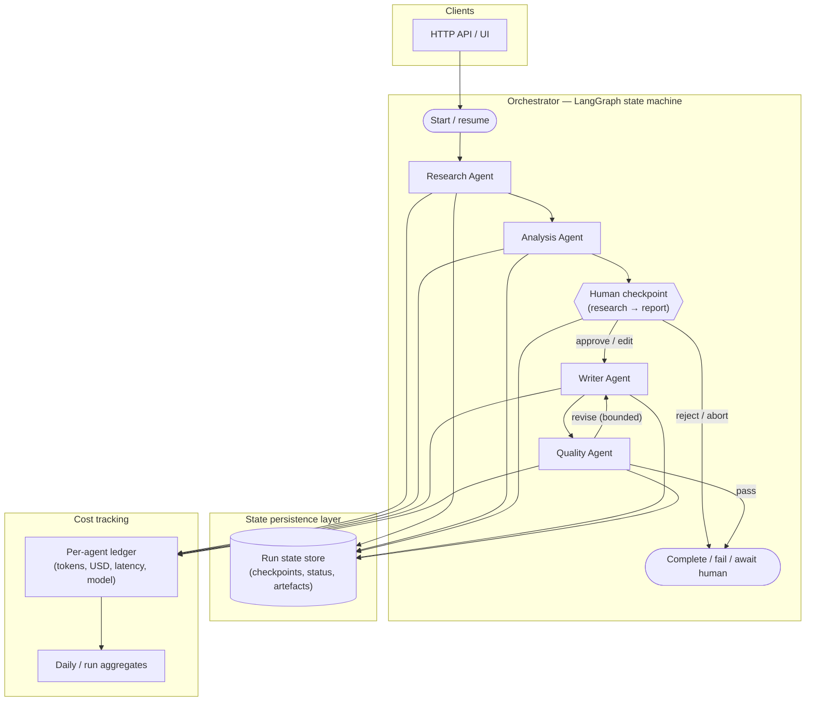

# Architecture — Multi-Agent Research System

## Purpose

This document describes the high-level architecture for a **multi-agent research pipeline** with an explicit **human checkpoint** after research and before report generation, plus **durable state** and **per-agent cost tracking**. It implements the problem scope in `docs/problem-definition.md` and aligns with `docs/AI-ENGINEERING-PLAYBOOK.md` and `docs/PORTFOLIO-ENGINEERING-STANDARD.md`.

## Architectural overview

The system centres on an **orchestrator** implemented as a **LangGraph state machine**. Specialist agents (**Research**, **Analysis**, **Writer**, **Quality**) are nodes or subgraphs invoked by the orchestrator. All cross-boundary data uses validated models (Pydantic in implementation). External I/O is async; configuration comes from environment-backed settings.

**Flow (happy path):**

1. User or API submits a research brief.
2. **Research Agent** gathers and normalises source material (search, retrieval, summaries as designed per phase).
3. **Analysis Agent** structures facts, gaps, and analytical themes from the research bundle.
4. **Human checkpoint** — workflow pauses until an analyst approves, edits, or rejects the research and analysis bundle.
5. On approval, **Writer Agent** produces the report draft in the requested format.
6. **Quality Agent** checks structure, consistency, citation coverage, and policy constraints; may loop back with bounded retries.
7. State is **persisted** after material transitions; **cost and token usage** are recorded **per agent step** and aggregated for limits and metrics.

## Mermaid — system context and orchestration

## Component responsibilities

| Component | Responsibility |
|-----------|----------------|
| **Orchestrator (LangGraph)** | Defines states, transitions, retries, and human-interrupt semantics; resumes from persisted checkpoints. |
| **Research Agent** | Retrieves and organises source-linked material for the brief (scope bounded in implementation). |
| **Analysis Agent** | Produces structured analysis (themes, risks, fact tables) from the research bundle; output validated before the checkpoint. |
| **Human checkpoint** | Gates transition from research/analysis to drafting; records human decision and optional edits to bundled artefacts. |
| **Writer Agent** | Generates the report draft from approved inputs and style constraints. |
| **Quality Agent** | Validates draft against rubric (citations, structure, banned claims); may request writer revision within limits. |
| **State persistence layer** | Durable storage for run status, graph checkpoints, and artefact references (exact technology in ADR 003). |
| **Cost tracking** | Per-agent attribution of model, tokens in/out, USD cost, latency; enforces configurable budgets. |

## API and layering (implementation direction)

Following the portfolio standard:

- **Routes** validate requests and delegate to a **research orchestration service**.
- **Services** coordinate LangGraph execution, persistence, and cost recording — no raw LLM calls in route handlers.
- **Repositories** isolate persistence; **AI client** wraps the provider with retries and structured logging.

## Observability

- **Correlation ID** on every request and log line affecting that run.
- **Structured JSON logging** for transitions, agent completion, human decisions, and cost events.
- **Health / ready / metrics** endpoints (paths as per project standard) exposing operational and cost summaries without leaking secrets.

## Related documents

- `docs/problem-definition.md` — business problem and goals
- `docs/decisions/001-orchestration-framework.md` — LangGraph vs alternatives
- `docs/decisions/002-agent-communication-pattern.md` — how agents share state
- `docs/decisions/003-state-persistence-strategy.md` — checkpoint storage
- `docs/decisions/004-human-checkpoint-design.md` — human-in-the-loop gate
- `docs/implementation-plan.md` — phased delivery
